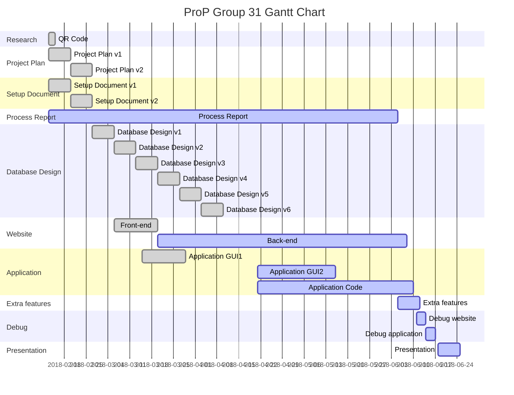

ProP Group 31
=============
>Edited: 08/05/2018 12:43

ONFest, which is part of the company Sypnosis, organizes music festivals. Due the increase of visitors to events, it has become more difficult to manage. This project's goal is to develop a solution to make events more manageable. 

http://i388898.hera.fhict.nl/ONFest/

Gantt Chart
-----------

Repository structure
----------
- Documentation
	- Database Design
	- Meetings
		- Agendas
		- Minutes
	- Process Report
	- Product Design
	- Project Plan
	- Setup Document
	- ToDo list
- Pictures
- Resources

Standards
---------
Documentation are to be named as following:
	`Document Name.vx`

Agendas and minutes are to be prefixed with the date as follows:
	`YYYYMMDD_agenda/minute.md`
	
Agendas, minutes and README files are of filetype Markdown(.md). Markdown files are easier to read in GitLab. To view these files outside of GitLab, simply open them with a text editor.